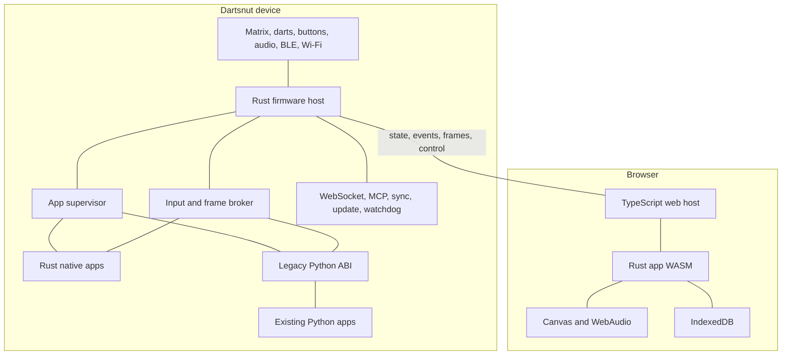
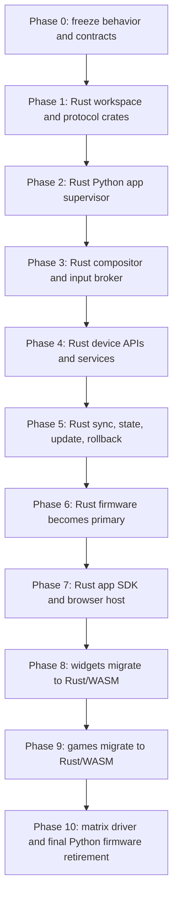

# Rust Firmware and Web Runtime Migration Plan

## Status

- **Document type:** Proposed migration plan
- **Target devices:** Dartsnut PixelDart and PixelBoard
- **Primary target:** Replace device firmware and first-party apps with Rust while preserving existing behavior
- **Compatibility target:** Continue running existing Python games and widgets without source changes
- **Web target:** Run migrated games and widgets locally in browsers through WebAssembly; expose legacy Python apps through device streaming during migration

## 1. Executive decision

Build a Rust firmware host with two app runtimes:

1. **Portable Rust runtime** for new and migrated apps. Compile each app to:
   - native ARM64 for device execution;
   - `wasm32` for browser execution.
2. **Legacy Python compatibility runtime** for existing games and widgets. Preserve current process, CLI, shared-memory, input, persistence, and package contracts.

Do not embed CPython inside the firmware process. Rust should supervise isolated Python subprocesses. This preserves per-app virtual environments, crash isolation, Pygame/Pillow behavior, and current dependency resolution.

Full migration has two completion levels:

- **Firmware completion:** all firmware services run in Rust; unchanged Python apps still work through compatibility ABI.
- **Product completion:** all first-party apps have Rust/WASM builds and run locally on device and web. Python support remains optional for legacy or community apps.

Rust firmware alone cannot make arbitrary Python/Pygame/Pillow apps execute locally inside browsers. Until each app has a Rust/WASM port, web access uses device-authoritative frame streaming and input forwarding.

## 2. Goals

### 2.1 Required goals

- Preserve all current device-visible behavior.
- Preserve WebSocket, BLE, Supabase, MCP, configuration, app package, and remote-control contracts.
- Run existing Python games and widgets without source changes.
- Introduce a native Rust app SDK.
- Compile the same Rust app source to device-native ARM64 and browser WebAssembly.
- Support synchronized device/web sessions.
- Preserve offline device operation.
- Preserve update, repair, and rollback paths throughout migration.
- Permit incremental rollout with immediate fallback to current Python firmware.

### 2.2 Desired improvements

- Faster startup and lower idle memory use.
- Stronger process supervision and failure recovery.
- Versioned app and IPC protocols.
- Deterministic input replay and app conformance tests.
- Safer app isolation with dedicated users and restricted capabilities.
- One app SDK for native and browser targets.

### 2.3 Non-goals

- Running arbitrary existing Python apps locally in browsers without modification.
- Removing Python from device images before all compatibility requirements are retired.
- Changing public API payloads or Supabase schemas during the firmware rewrite.
- Rewriting every app before Rust firmware can ship.

## 3. Current compatibility surface

Existing apps depend on undocumented runtime behavior. Migration must treat this behavior as a stable ABI.

### 3.1 Python process contract

Games currently launch as:

```text
apps/<id>/.venv/bin/python main.py
  --shm game_shm
  --data-store /var/lib/dartsnut/user/<user>/<app>/
```

Widgets currently launch as:

```text
apps/<id>/.venv/bin/python main.py
  --params <json>
  --shm widget_<page_uuid>_<index>_shm
  --data-store /var/lib/dartsnut/user/<user>/<app>/
```

Compatibility includes:

- current working directory;
- environment variables;
- app-local `.venv` selection;
- process groups and parent-death behavior;
- `SIGSTOP` and `SIGCONT` for widget page suspension;
- forced process-tree termination;
- stdout/stderr logging behavior;
- app data paths and permissions.

### 3.2 Legacy display ABI

Game frame memory:

```text
name: game_shm
byte 0: producer/consumer state
bytes 1..N: RGB888 frame
maximum frame: 128 x 160 x 3 bytes
```

Widget frame memory:

```text
name: widget_<page_uuid>_<widget_index>_shm
byte 0: producer/consumer state
bytes 1..N: widget rectangle in RGB888
```

Existing state-byte semantics must remain unchanged:

- `0`: fresh app frame ready for host consumption;
- `1`: host consumed frame; app may write next frame;
- `2`: display path busy or unavailable where currently used.

Existing `pydartsnut` also opens POSIX semaphore:

```text
/pdishm_render_ready
```

Rust may introduce a new internal frame broker, but it must expose this legacy surface to Python apps.

### 3.3 Legacy input ABI

Existing `pydartsnut` reads:

```text
/dev/shm/pdoshm
```

Required compatibility:

- current button bit layout;
- twelve dart coordinate slots;
- invalid coordinate sentinel values;
- coordinate mapping and clamping;
- debounce timing;
- dart-hit blocking and unblock timing;
- controller-to-button mapping.

### 3.4 App package contract

Existing package behavior must remain supported:

- `.tar.gz` app downloads;
- `conf.json` metadata and field schema;
- backend app metadata;
- per-app `pyproject.toml` or managed default dependencies;
- app-local assets and fonts;
- per-app virtual environments;
- version checking and background updates;
- MD5 verification while backend protocol still requires it.

New packages should use a versioned `manifest.json`, but old `conf.json` packages remain valid.

### 3.5 External protocol contracts

Preserve without breaking changes:

- WebSocket server on port `9251` and `/ws`;
- current JSON action names, fields, error codes, and response envelopes;
- BLE GATT onboarding and control behavior;
- MCP service behavior on port `9252`;
- Supabase `remote_devices.state` schema;
- bridge Unix socket message kinds;
- remote command/watchdog semantics;
- `device.json`, `apps/conf.json`, and user data layouts;
- systemd-visible update, repair, and rollback behavior.

## 4. Target architecture



### 4.1 Rust firmware workspace

Suggested workspace:

```text
firmware-rs/
├── Cargo.toml
├── crates/
│   ├── dartsnut-protocol/
│   ├── dartsnut-hardware/
│   ├── dartsnut-display/
│   ├── dartsnut-input/
│   ├── dartsnut-app-runtime/
│   ├── dartsnut-python-compat/
│   ├── dartsnut-websocket/
│   ├── dartsnut-ble/
│   ├── dartsnut-network/
│   ├── dartsnut-sync/
│   ├── dartsnut-update/
│   ├── dartsnut-mcp/
│   └── dartsnut-firmware/
└── tests/
    ├── protocol/
    ├── app-compat/
    ├── replay/
    └── hardware/
```

### 4.2 Portable Rust app SDK

Apps should depend on capabilities, not device implementation:

```rust
pub trait DartsnutApp {
    fn initialize(&mut self, context: &mut AppContext) -> Result<()>;
    fn update(&mut self, context: &mut AppContext, input: &InputFrame) -> Result<()>;
    fn render(&mut self, context: &mut AppContext, frame: &mut FrameBuffer) -> Result<()>;
    fn suspend(&mut self, context: &mut AppContext) -> Result<()>;
    fn resume(&mut self, context: &mut AppContext) -> Result<()>;
    fn shutdown(&mut self, context: &mut AppContext) -> Result<()>;
}
```

Platform services should include:

- monotonic and wall clocks;
- deterministic random seed;
- dart and button input;
- RGB frame output;
- audio playback;
- key/value persistence;
- app parameters;
- asset loading;
- HTTP requests;
- structured logging;
- suspend/resume lifecycle;
- capability discovery.

Device backend uses native hardware and filesystem. Web backend uses Canvas, WebAudio, browser fetch, and IndexedDB.

### 4.3 Web host

Browser host responsibilities:

- load signed app manifest and WASM bundle;
- provide app parameters and capabilities;
- map mouse/touch/keyboard/gamepad input into Dartsnut events;
- render RGB frames to Canvas with nearest-neighbor scaling;
- provide WebAudio output;
- store app data in IndexedDB;
- proxy protected API calls through backend services;
- connect to device for synchronized sessions;
- enforce memory, CPU, network, and lifecycle limits.

## 5. Web execution modes

### 5.1 Mode A: local Rust/WASM execution

Final preferred mode.

- Same Rust app source compiles to native ARM64 and WebAssembly.
- Device and browser can run independently.
- Synchronized sessions exchange input and state events.
- Browser does not need a physical device for demo or preview mode.

### 5.2 Mode B: device-authoritative remote execution

Compatibility mode for existing Python apps.

- Python app runs on device.
- Rust firmware streams frames and state to browser.
- Browser sends authorized input to device.
- Device remains session authority.
- Every existing app becomes web-accessible before its Rust port exists.

This mode is remote execution, not local browser execution.

### 5.3 Mode C: synchronized native and web execution

Used after an app has Rust/WASM targets.

Required session protocol:

```text
session_id
app_id
app_version
authority
random_seed
tick
event_sequence
input events
state snapshots
state hash
resume token
```

Use one authority per session. Device authority is preferred for physical dart games. Server authority may be used for multiplayer. Avoid two independent authoritative instances.

## 6. Proposed migration flow



Each phase ends with a compatibility gate. A phase cannot replace production behavior until its gate passes.

## 7. Migration phases and acceptance gates

### Phase 0: freeze behavior and document contracts

Deliverables:

- versioned specification for legacy shared memory;
- recorded button and dart input layouts;
- process launch and lifecycle specification;
- app package specification;
- WebSocket action fixture suite;
- BLE GATT fixture suite;
- Supabase state and bridge fixture suite;
- reference framebuffer recordings;
- device boot, update, reset, and rollback traces;
- inventory of all 25 games and 47 widgets.

Gate:

- Existing Python firmware passes frozen black-box suite.
- Every external contract has at least one success and failure fixture.
- Unknown hardware behavior is explicitly listed.

### Phase 1: Rust workspace and shared protocol crates

Deliverables:

- Rust workspace and CI builds for x86-64 and ARM64;
- shared protocol types for input, frames, app lifecycle, sync, and APIs;
- serializers compatible with existing JSON payloads;
- structured logging and error-code mapping;
- fake hardware backend for CI.

Gate:

- Rust protocol fixtures match Python-generated fixtures byte-for-byte.
- No production service replacement yet.

### Phase 2: Rust Python app supervisor

Deliverables:

- app package discovery and metadata loading;
- existing `.venv` and `uv` setup orchestration;
- exact game/widget CLI arguments;
- process groups, parent-death cleanup, suspend/resume, and termination;
- user data path compatibility;
- app crash and timeout reporting;
- legacy POSIX shared-memory creation.

Gate:

- All Python apps start through Rust supervisor.
- Widget suspend/resume behavior matches current firmware.
- App crash cannot crash Rust firmware.
- Existing game/widget files require no source changes.

### Phase 3: Rust compositor and input broker

Deliverables:

- page composition and widget rectangle handling;
- game and widget frame handshakes;
- loading indicators and pause overlays;
- input normalization for darts, buttons, keyboard-style controllers, and gamepads;
- legacy `pdishm`, `pdoshm`, and semaphore compatibility;
- frame/event capture for web streaming and tests.

Gate:

- Recorded input replay produces equivalent state transitions.
- Golden frames match within defined tolerance.
- No dropped-frame or deadlock regression under stress.
- All Python games receive correct dart/button events.

### Phase 4: Rust device APIs and services

Deliverables:

- WebSocket server with all existing actions and errors;
- BLE onboarding and control;
- Wi-Fi management;
- controller scan, pairing, connection, and removal;
- MCP service;
- device info, brightness, volume, dim window, QR, and reset workflows;
- app download, checksum, extraction, update, and removal.

Gate:

- Current mobile/web clients pass without modification.
- WebSocket and BLE fixture suites pass.
- Offline onboarding and recovery pass on real hardware.

### Phase 5: Rust state, sync, update, and rollback

Deliverables:

- machine state persistence;
- Supabase event reduction and outbound retry behavior;
- existing Rust bridge integration or direct consolidation;
- game readiness/status semantics;
- pages and Bluetooth remote sync;
- firmware update, repair, watchdog, and rollback orchestration;
- playtime and user data compatibility.

Gate:

- Existing Supabase integration and contract tests pass.
- Network disconnect/reconnect tests preserve queued state.
- Interrupted update returns to last known-good firmware.
- Old and new firmware can operate against same backend schema.

### Phase 6: Rust firmware becomes primary

Deliverables:

- production systemd service for Rust firmware;
- boot-time selector for Rust or Python firmware;
- health watchdog and automatic fallback;
- production logging and diagnostic snapshots;
- staged device cohort controls.

Gate:

- Full hardware regression suite passes.
- All 25 games and 47 widgets pass smoke tests.
- Burn-in passes without memory, descriptor, or process leaks.
- Rollback to Python firmware requires no user-data migration.

### Phase 7: Rust app SDK and browser host

Deliverables:

- stable Rust app API;
- native and WASM build templates;
- TypeScript browser host;
- Canvas, WebAudio, fetch, storage, and input adapters;
- package signing and capability declarations;
- local preview/developer tools;
- device-authoritative streaming for Python apps;
- synchronized session protocol.

Gate:

- Reference widget runs from same source on device and browser.
- Reference game runs from same source on device and browser.
- Deterministic replay produces matching state hashes.
- Existing Python app is usable through browser streaming.

### Phase 8: migrate widgets to Rust/WASM

Suggested order:

1. static image and text widgets;
2. clocks and deterministic animations;
3. weather and public-data widgets;
4. sports/finance widgets;
5. image-upload and API-key widgets;
6. factory and hardware-specific tools.

Migration requirements:

- same `conf.json` field behavior;
- equivalent default values;
- equivalent display dimensions and crop behavior;
- protected API calls moved behind server proxy where browser secrets would leak;
- screenshot comparison against Python version;
- native and WASM targets shipped from one source package.

Gate:

- Widget passes visual, configuration, network, timezone, and persistence tests.
- Rust version can replace Python version without changing page configuration.

### Phase 9: migrate games to Rust/WASM

Suggested order:

1. Tic-Tac-Toe or another small state-machine game;
2. score-based dart games;
3. simple animated games;
4. audio-heavy games;
5. physics-heavy games;
6. PICO-8 and other native-runtime special cases.

Migration requirements:

- game logic separated from renderer;
- deterministic random source;
- fixed or explicitly versioned simulation tick;
- input event log and replay;
- state snapshot and hash support;
- equivalent scoring, AI, timing, persistence, and audio behavior;
- same device controls and browser input mapping.

Gate:

- Native and WASM versions pass identical replay scenarios.
- Device and browser can join one synchronized session.
- Python version remains rollback target until production soak passes.

### Phase 10: matrix driver and final Python firmware retirement

The current `DartsnutRGBMatrix` is a precompiled ARM binary. Its source and exact hardware timing behavior are not present in this repository.

Deliverables:

- Rust matrix driver or validated Rust binding to retained low-level driver;
- brightness, refresh, color, latency, and panel compatibility tests;
- final removal of Python firmware service;
- Python runtime retained only for legacy apps;
- optional device image without Python after legacy support is formally retired.

Gate:

- Matrix output passes hardware measurement and long burn-in.
- No visible refresh, brightness, color, or input-latency regression.
- Rust firmware owns every firmware function.

## 8. Feature compatibility checklist

### Display and UI

- [ ] 128x128 main display behavior
- [ ] 128x160 composite framebuffer
- [ ] 64x32 secondary region behavior
- [ ] widget rectangle composition
- [ ] loading indicators
- [ ] game selector and previews
- [ ] pause/end-game overlay
- [ ] settings and QR screens
- [ ] brightness transitions and dim windows
- [ ] transient snackbar messages

### Inputs

- [ ] twelve dart coordinate slots
- [ ] dart-hit debounce/blocking semantics
- [ ] physical buttons
- [ ] Bluetooth controller buttons and axes
- [ ] USB event-device controllers
- [ ] browser keyboard, touch, pointer, and gamepad mapping
- [ ] synchronized input ordering

### Apps

- [ ] legacy Python game launch
- [ ] legacy Python widget launch
- [ ] per-app virtual environments
- [ ] parameter schema
- [ ] user data store
- [ ] app suspend/resume
- [ ] crash cleanup
- [ ] download/update/remove
- [ ] preview cache
- [ ] playtime tracking
- [ ] game remote status
- [ ] Rust native app target
- [ ] Rust WASM app target

### Connectivity and control

- [ ] BLE onboarding
- [ ] Wi-Fi scan/connect/forget
- [ ] Bluetooth controller lifecycle
- [ ] WebSocket API
- [ ] MCP API
- [ ] Supabase sync
- [ ] offline outbox/retry
- [ ] remote command watchdog
- [ ] network state publication

### Device lifecycle

- [ ] boot and service ordering
- [ ] device identity repair
- [ ] firmware update
- [ ] interrupted-update repair
- [ ] rollback
- [ ] reset and Wi-Fi forget confirmation
- [ ] logs and diagnostics
- [ ] power-loss recovery

## 9. Compatibility test strategy

### 9.1 Contract tests

Run identical fixtures against Python and Rust implementations:

- WebSocket requests and responses;
- BLE commands and notifications;
- shared-memory byte layouts;
- app metadata normalization;
- Supabase state reduction;
- error-code mapping;
- persistent JSON formats.

### 9.2 Input replay

Record real sessions as timestamped events:

```json
{
  "tick": 1234,
  "sequence": 88,
  "kind": "dart_hit",
  "dart_index": 2,
  "x": 63,
  "y": 41
}
```

Replay into old and new runtimes. Compare:

- state transitions;
- scores;
- persistence writes;
- state hashes;
- selected golden frames.

### 9.3 Visual comparison

- Capture RGB frames from both runtimes.
- Require exact matches for deterministic pixel renderers.
- Allow documented tolerance for font, alpha, or platform rasterization differences.
- Review animation timing across fixed replay ticks.

### 9.4 Hardware qualification

Test on every supported hardware revision:

- panel refresh and color;
- dart coordinate calibration;
- button latency;
- controller pairing and reconnect;
- Wi-Fi onboarding and reconnect;
- audio output;
- boot time;
- thermal and long-run stability;
- power interruption during app and firmware updates.

## 10. Deployment and rollback

### 10.1 Dual-firmware period

Ship both entry points:

```text
dartsnut-firmware-rs.service
dartsnut-python.service
```

Only one owns active firmware state. A boot configuration selects implementation.

### 10.2 Rollout sequence

1. development hardware;
2. internal test devices;
3. opt-in beta cohort;
4. small production cohort;
5. staged production expansion;
6. Rust default with Python fallback;
7. Rust-only firmware after compatibility gates pass.

### 10.3 Rollback requirements

- Rust and Python use same persistent schemas during transition.
- Rust never performs irreversible data migration without versioned backup.
- Service selector can return to Python on next boot.
- Failed health checks trigger known-good version.
- App packages remain usable by old firmware until migration is complete.

## 11. Security model

Existing firmware and child apps currently inherit broad privileges. Rust migration should introduce isolation after compatibility is established:

- dedicated firmware and app users;
- explicit `/dev/shm` permissions;
- no direct app access to matrix or sensor devices;
- filesystem restrictions per app;
- network capability declarations;
- secret-bearing API calls proxied server-side;
- signed app manifests and bundles;
- CPU, memory, process, and frame-rate limits;
- optional seccomp and Linux namespace isolation.

Privilege tightening must have its own compatibility gate because existing apps may rely on undocumented filesystem or subprocess access.

## 12. Main risks and mitigations

### Matrix driver behavior is not fully represented in source

Mitigation:

- retain current binary during early migration;
- capture protocol and hardware measurements;
- replace only after production behavior is understood.

### Hidden Python app dependencies

Mitigation:

- run every existing app through compatibility harness;
- record filesystem, subprocess, environment, and network usage;
- preserve Python runtime and virtualenv behavior initially.

### Dual-runtime complexity

Mitigation:

- keep process boundary explicit;
- use one app supervisor;
- version every IPC and package contract;
- avoid embedding CPython.

### Browser and device divergence

Mitigation:

- shared Rust source;
- deterministic clock and random source;
- input replay;
- state hashes;
- one session authority.

### Browser secrets and CORS

Mitigation:

- proxy protected third-party APIs;
- never place durable secrets in WASM or browser bundles;
- declare network capabilities in manifest.

### Rewrite introduces broad regression risk

Mitigation:

- strangler migration, not one-time replacement;
- black-box compatibility fixtures;
- dual-firmware rollout;
- automatic rollback;
- phase gates tied to measured behavior.

## 13. Definition of done

### Firmware done

- Rust is production firmware entry point.
- All firmware services run in Rust or as explicitly retained Rust components.
- All existing external APIs and schemas remain compatible.
- All 25 current games and 47 current widgets run unchanged through Python compatibility runtime.
- Device update, rollback, BLE, Wi-Fi, controllers, sync, and hardware tests pass.
- Python firmware service is no longer required.

### Web done

- Browser host runs Rust/WASM apps locally.
- Every first-party widget has Rust native and WASM builds.
- Every first-party game has Rust native and WASM builds, or an approved exception.
- Device and browser can participate in synchronized sessions.
- Legacy Python apps remain usable on web through device streaming.

### Full product migration done

- All first-party firmware and app source is Rust, apart from browser host glue and explicitly approved native dependencies.
- Python exists only as an optional legacy/community compatibility runtime.
- New apps target Rust native and WASM by default.
- Production metrics show no material regression in latency, stability, power use, or user-visible behavior.

## 14. Immediate next steps

1. Approve legacy Python ABI as a supported product contract.
2. Write byte-level specifications for `pdishm`, `pdoshm`, game/widget shared memory, and render semaphore.
3. Create black-box fixtures from current Python firmware.
4. Scaffold Rust workspace and protocol crate.
5. Build a Rust supervisor spike that launches:
   - one simple widget;
   - one Pygame game;
   - one network widget.
6. Verify unchanged Python apps can render and receive recorded input.
7. Build one Rust reference widget for native ARM64 and WebAssembly.
8. Measure device/web frame timing, package size, memory, and startup cost.
9. Decide whether current matrix binary remains as a supported low-level component or must be replaced.
10. Produce phase estimates only after spikes expose matrix and Python compatibility risks.

